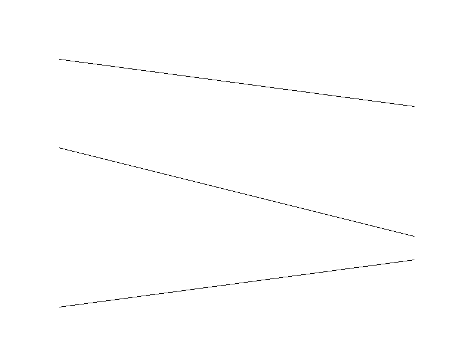

# Algoritmo de Bresenham

Implementación del algoritmo de Bresenham para dibujar líneas sobre un framebuffer utilizando únicamente aritmética entera.

## Objetivo

Implementar el algoritmo de Bresenham para dibujar líneas en diferentes direcciones y pendientes, incluyendo todos los octantes.

## Lenguaje utilizado

- Rust

## Estructura del proyecto

```text
src/
├── framebuffer.rs
├── line.rs
├── bmp.rs
└── main.rs
```

### `framebuffer.rs`

Contiene la estructura del framebuffer y la función que permite colocar píxeles en la imagen.

### `line.rs`

Contiene la función `draw_line`, que implementa el algoritmo de Bresenham usando operaciones enteras.

### `bmp.rs`

Contiene la función encargada de guardar el contenido del framebuffer en un archivo BMP.

### `main.rs`

Crea el framebuffer, dibuja varias líneas con diferentes pendientes y genera la imagen final.

## Método de Bresenham

El algoritmo de Bresenham determina qué píxeles deben activarse para representar una línea entre dos puntos.

Utiliza una variable de error para decidir cuándo debe avanzar en el eje horizontal y cuándo debe avanzar en el eje vertical.

Una de sus ventajas principales es que trabaja únicamente con números enteros, por lo que evita cálculos con punto flotante.


## Imagen de las líneas creadas por cada método


## Resultado

La siguiente imagen fue generada utilizando el algoritmo de Bresenham:



## Ejecución

Para ejecutar el proyecto:

```bash
cargo run
```

Después de ejecutar el programa, se genera el archivo:

```text
out.bmp
```

en la carpeta principal del proyecto.

## Repositorio

Proyecto realizado como ejercicio de gráficos por computadora.
